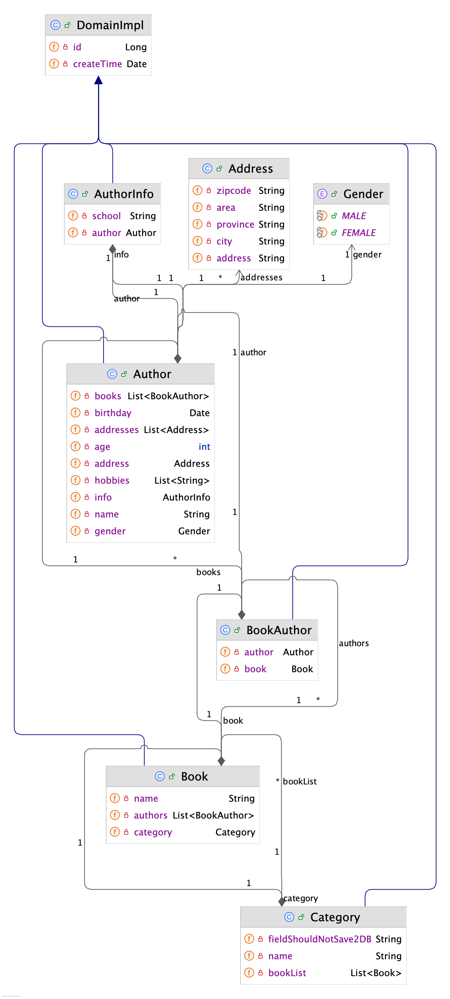
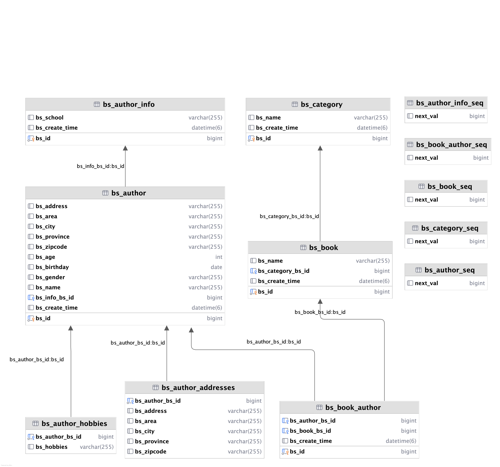

# Design Doc

## Introduction

In bookstore this project we have defined multiple domain entities: Author, AuthorInfo, Book, BookAuthor, Category.

Their E-R Relationships are shown in the following diagrams.


---

### E-R Diagram



### Database Table Diagram 


## Entity Relationships

### Entity Relationship: Author - Address (1:1)

The relationship between **Author** and **Address** is a **composition**, where Address is a value object that belongs
to Author. We use `@Embedded` in Author to include **Address** as part of the same table, and `@Embeddable` in Address
to define it as a reusable value type. This approach avoids extra joins and keeps related data together.

### Entity Relationship: Category - Book (1:N)

In JPS, the best practice for a **one-to-many** relationship without generating an extra join table is manage the
foreign key form the **many-side (Book)** while keeping the **one-side(Category) unaware of relationship**. This avoids
unnecessary complexity and ensures efficient data retrieval.

Setting up a **bidirectional** relationship between `Category` and `Book`.

#### `Category.java`

- **mappedBy='category'** tells JPA that the Category entity's relationship to Book is already defined on the **Book
  side**.
- This means the **category** this field in Book will handle the foreign key(category_id), and JPA will not create a
  middle table or duplicate the relationship on the Category side.
- In other words, it is the **Book(many-side)** owned the relationship and maintain/record the relationship by foreign
  keys.
- Since the relationship is recorded as FK in Book table, Category side can get access to its associated multiple Books
  via this variable(bookList).
- Once we choose to let the many-side(Book) own the relationship with a foreign key in the table, we need to define how
  modifications on the one-side will affect the many-side, and how many-side's modification will be synchronized to the
  one side.
- **OrphanRemoval**: Ues `orphanRemoval=true` in @OneToMany to automatically delete Book entities when they are removed
  from the bookList.
- **Cascade**: Use `cascade=CascadeType.ALL` to propagate operations like PERSIST, MERGE, and REMOVE from Category to
  associated Book entities.

```java
import com.cloud.bookshop.domain.Book;
import jakarta.persistence.CascadeType;
import jakarta.persistence.OneToMany;

@OneToMany(mappedBy = "category", cascade = CascadeType.ALL, orphanRemoval = true)
private List<Book> bookList; 
```

#### `Book.java`

- When adopting `@ManyToOne` annotation here, to enable bidirectional navigation.
- No extra join table(like `category_book`) is created automatically by JPA.
- **Category** does not **own** and **maintain** the relationship, so it doesn't need to track its associated books
  explicitly.

```java
import com.cloud.bookshop.domain.Category;
import jakarta.persistence.FetchType;
import jakarta.persistence.ManyToOne;

@ManyToOne(fetch = FetchType.LAZY, optional = false)
private Category category; 
```

### Entity Relationship: Author: AuthorInfo(1:1)

In a one-to-one relationship, let the most frequently used side (in this case, the Author) manage the relationship.

- **Bidirectional Relationship**:
    - Use `@OneToOne` on both entities to make the relationship bidirectional.
    - On the Author side, the relationship is maintained, so we don't need to use mappedBy here.
- **Owning side**:
    - On the **AuthorInfo** side, we use `@OneToOne(mappedBy="info")` to indicate that `AuthorInfo` is the inverse side,
      and `Author` owns the relationship.
- **Cascade**: Cascade is also supported in OneToOne relationship in JPA.

- `Author.java`

```java
import com.cloud.bookshop.domain.AuthorInfo;
import jakarta.persistence.OneToOne;

@OneToOne
private AuthorInfo info; 
```

- `AuthorInfo.java`

```java
import jakarta.persistence.OneToOne;
// mappedBy means this relationship is handed over to Author side's Author#info this field
@OneToOne(mappedBy = "info")
private Author author; 
```

### Entity Relationship: Author:AuthorHobbies(1:N)

- For a 1:N relationship where `Author` has a list of simple type `String` hobbies, the relationship is stored using
  `@ElementCollection`. This annotation can also be used for other embedded objects.

- When we use `@ElementCollection` with `@CollectionTable`, a foreign key is generated for the relationship between the
  entity and the collection, but it behaves differently compared to a typical `@OneToOne` or `@ManyToOne` relationship.
  - The collection does not create a full entity for each item(like with `@OneToMany`), meaning no separate entity table
    with a foreign key to the collection items themselves.
  - **One-To-Many Behavior**: Though it may seem like a `One-to-Many` relationship(i.e., one Author to many hobbies or
    addresses), it doesn't have the full entity lifecycle associated with `@OneToMany` The collection table is just a
    simple table storing the data, and the FK references the parent entity.

- Author.java

```java
import com.cloud.bookshop.domain.Address;
import jakarta.persistence.ElementCollection;

@ElementCollection
private List<String> hobbies;

// diff from OneToMany, ElementCollection does not have the full entity's lifecycle.
@ElementCollection
private List<Address> addressList; 
```

### Entity Relationship: Author : Book (M:N)

In **many-to-many** relationship between `Author` and `Book`, according to JPA best practices, it is recommended to use
a **join table** to store the relationship, rather than directly using the `@ManyToMany` annotation. This approach not
only enhances the flexibility of the relationship but also allows for better control and the ability to add additional
attributes to the relationship itself.
A **bidirectional** relationship ensures that both entities can navigate th relationship in both directions. For
instance, from a `Book`, we can access the `Author(s)`, and from an `Author`, we can access the `Book(s)` they've
authored. To achieve this, we use this `join table` and specify the `mappedBy` attribute on each side of the
relationship.

- BookAuthor.java

```java
// This entity is created to store the Book & Author mapping relationships
@Data
@Entity
public class BookAuthor extends DomainImpl {

  @ManyToOne
  private Book book;

  @ManyToOne
  private Author author;
}
```

- Author.java

```java

// here the mappedBy 'author' is delegating the relationship management
// to the 'author' field in the BookAuthor entity, which links the Author entity 
// to its associated Book(s) through the join table. 
// Author -> BookAuthor#author 
@OneToMany(mappedBy = "author")
private List<BookAuthor> books;
```

- Book.java

```java
import com.cloud.bookshop.domain.BookAuthor;
import jakarta.persistence.OneToMany;


// here the mappedBy 'book' is delegating the relationship management 
// to the 'book' field in the BookAuthor entity, which links the Book entity to its 
// associated Author(s) through the join table. 
// Book -> BookAuthor#book 
@OneToMany(mappedBy = "book")
private List<BookAuthor> authors; 
```
